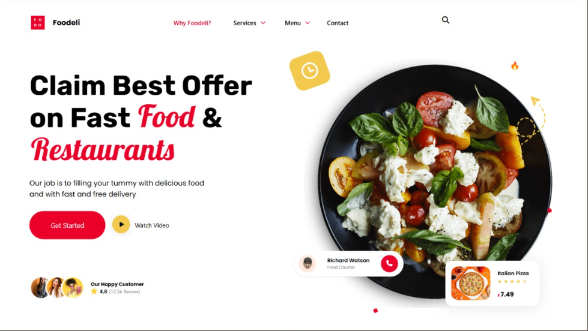

# lima_restaurante

sobre o projeto: o objetivo do projeto era, usando HTML e Tailwind, criar uma tela responsiva que se moldasse nos tamanhos desktop, tablet e celular.

como executar o projeto: Para executar este projeto, clique no link que está na aba de Descrição do repositório.

tecnologias: HTMML, CSS e Tailwind.

Autor:: Mateus Lins de Jesus 